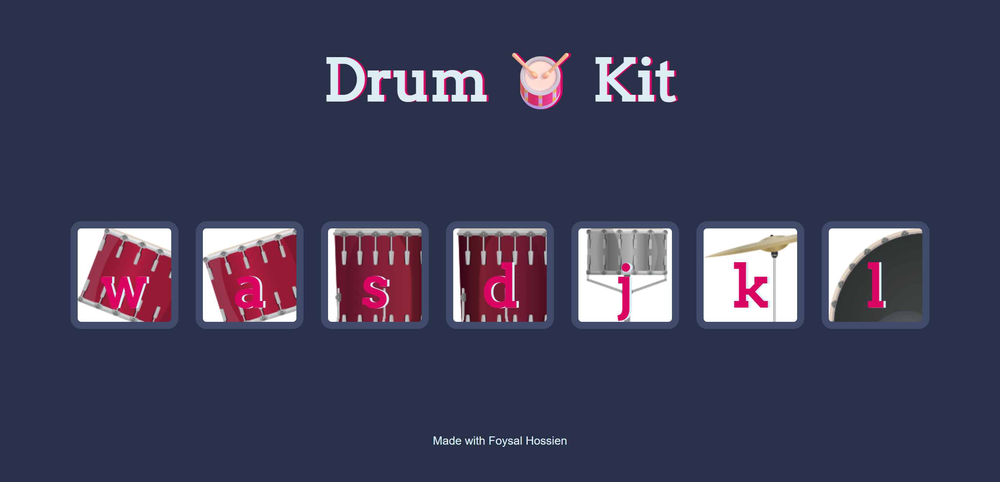

# Drum Kit

An interactive Drum Kit built with HTML, CSS, and JavaScript.

## About

Drum Kit is an interactive web project where users can play different drum sounds by clicking the drum buttons or pressing the corresponding keys on the keyboard.

The project uses JavaScript DOM manipulation, event handling, keyboard events, and audio playback to create an interactive drumming experience.

## Live Demo

[View Live Demo](https://foysaliio.github.io/Drum-Kit/)

## Screenshot

## Features

• Play drum sounds by clicking buttons
• Play drum sounds using keyboard keys
• Multiple drum sounds
• Click event handling
• Keyboard event handling
• Interactive button animations
• Dynamic audio playback

## Technologies Used

• HTML5
• CSS3
• JavaScript
• DOM Manipulation
• JavaScript Audio

## What I Practiced

• DOM selection
• DOM manipulation
• querySelectorAll()
• forEach()
• addEventListener()
• Click events
• Keyboard events
• event.key
• Arrow functions
• Functions
• switch statement
• setTimeout()
• classList.add()
• classList.remove()
• Audio playback

## Project Structure

Drum Kit/
│
├── images/
├── sounds/
├── index.html
├── script.js
├── styles.css
└── README.md

## How to Use

1. Click any drum button to play its sound.
2. Press the corresponding keyboard key to play the sound.
3. Try different keys to play different drum sounds.
4. Enjoy creating your own drum beats.

## Learning Goal

The main goal of this project is to practice JavaScript DOM manipulation, click and keyboard events, audio playback, and handling user interactions by building an interactive Drum Kit.
